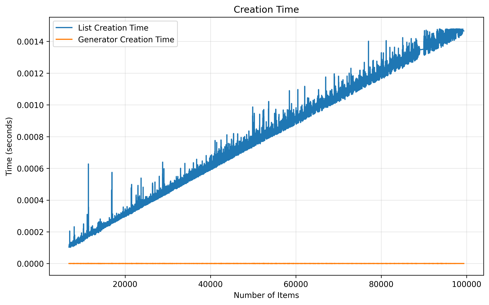
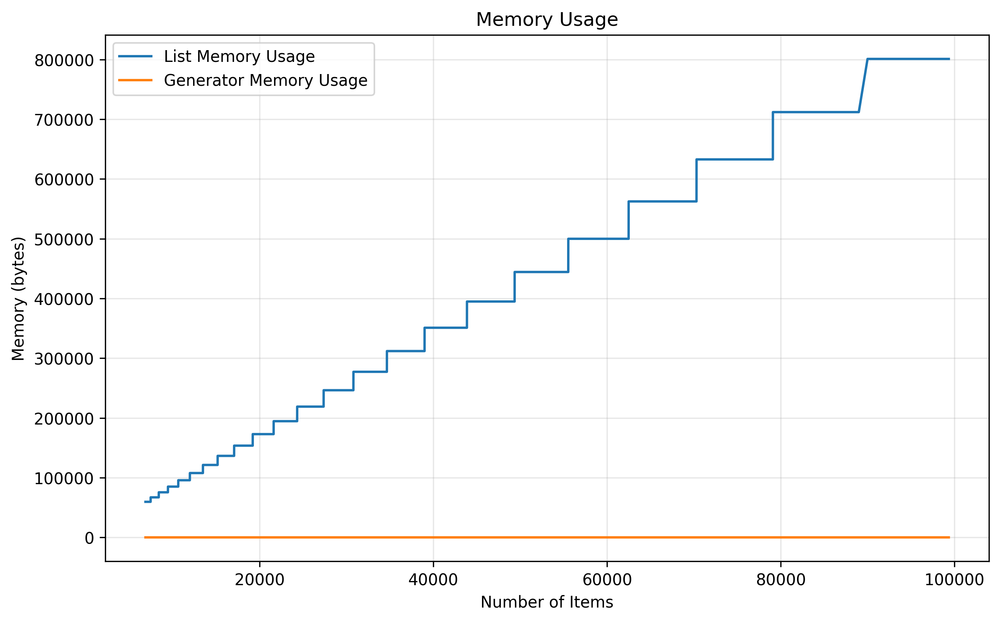
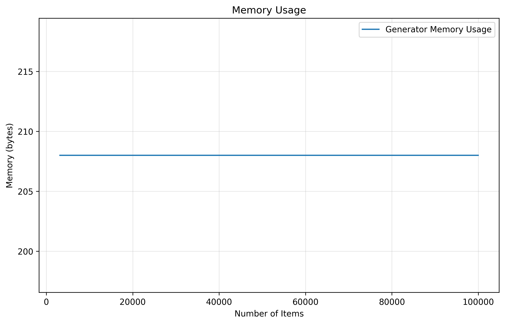
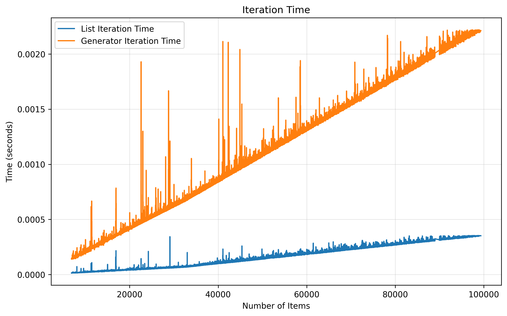
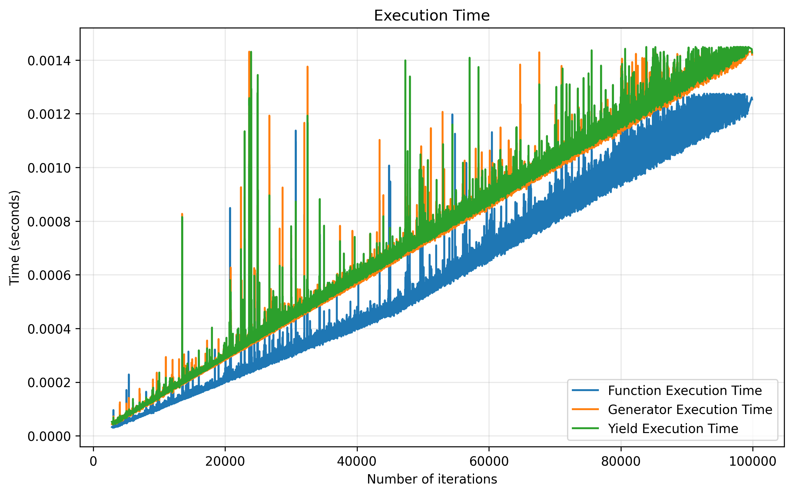
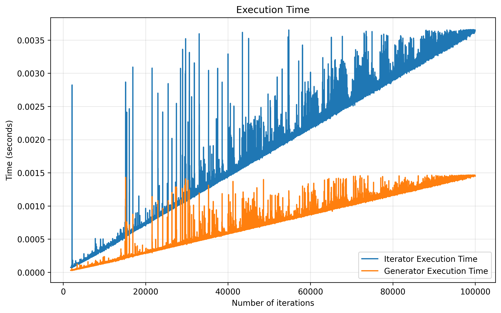
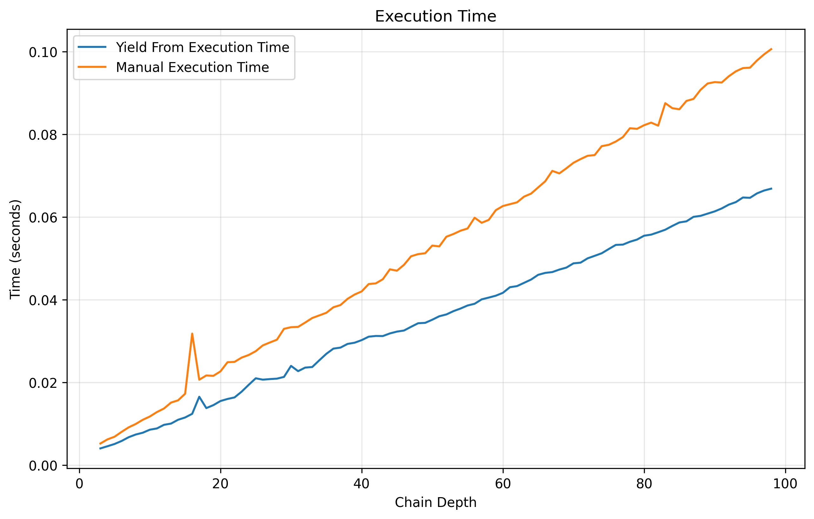

# Генераторы в Python: архитектура, ограничения и альтернативы

В данном исследовании я погружаюсь в структуру генераторов в Python, чтобы понять, почему они не поддерживают сериализацию и как они управляют своим состоянием. Я исследую внутреннюю структуру генератора, его фрейма и процесс выполнения, а также сравниваю его с обычными функциями и итераторами. Целью исследования является не только теоретическое понимание генераторов, но и практические рекомендации по их использованию в реальных сценариях.

### Предисловие

Во время своей стажировки в МТС я столкнулся с задачей, лёгшей в основу моего исследования.

У вас есть сервер, который обрабатывает сложные алгоритмы из нескольких задач, и хосты, которые могут выполнять простые задачи по запросу сервера. Сервер определяет, какую задачу необходимо выполнить, высылает хосту запрос на её выполнение, ждет результата, а затем продолжает выполнение алгоритма с того же места, на котором он остановился.

Подобная задача идеальна для генератора в Python, который может приостанавливать выполнение функции, сохраняя состояние. Однако возникает новое условие: мы не можем гарантировать, что всё время ожидания результата сервер будет находиться в рабочем состоянии, поэтому после отправки задачи необходимо сериализовывать состояние алгоритма и помещать его в базу данных, а при получении результата от хоста восстанавливать его и продолжать выполнение.

Здесь и возникает проблема: при использовании модуля `dill`, который является расширением стандартного модуля `pickle` и повсеместно используется для сериализации объектов в Python, при попытке сериализации генератора возникает ошибка `TypeError: cannot pickle 'generator' object`. Вы можете изучить описанный сценарий в файле `src/benchmarks/real.py` или посмотреть на более простой пример в файле `src/benchmarks/simple.py`.

```bash
git clone git@github.com:gleb-pp/pygen-research.git
cd pygen-research
pip install poetry
poetry install
poetry run python src/benchmarks/simple.py
```

После изучения нескольких статей и обсуждения с нейросетями, я получил ответ о том, что генераторы в Python не поддерживают сериализацию, и что это ограничение не конкретного модуля `dill`, а структуры генераторов в Python в целом. Тогда я подумал, что это довольно смелое заявление, ведь генераторы - это всего лишь объекты, и если `dill` может сериализовать функции, классы и даже замыкания, то в чем особенность генераторов? Это заставило меня глубже погрузиться в этот вопрос и изучить их внутреннюю структуру.

## Введение в генераторы

### Что такое генератор?

Генератор — это итератор, создаваемый функцией с ключевым словом `yield`. В отличие от классических итераторов (например, `list_iterator`), где программист явно хранит состояние в полях объекта, генератор неявно сохраняет весь контекст выполнения — локальные переменные, текущую инструкцию и стек — в специальной структуре `_PyInterpreterFrame`. Фрейм остается в памяти между вызовами `next()` и уничтожается только при исчерпании генератора или явном закрытии.

```python
def gen():
    print("Hello, World!")
    a = yield 0
    print(f"Received: {a}")
    b = yield 1
    print(f"Received: {b}")

g = gen()
print(next(g))     # print "Hello, World!" and yield 0
print(g.send(10))  # print "Received: 10" and yield 1
print(g.send(20))  # print "Received: 20" and raise StopIteration
```

### Функции-генератора

В примере выше `gen()` — это функция-генератор, а `g` — объект генератора. Функция-генератор, как и обычная функция, может содержать локальные переменные, принимать аргументы и возвращать значения. Однако эти объекты по-разному управляют своим состоянием и памятью.

При вызове обычной функции в Python создается новый фрейм, исполняется код, возвращается результат, затем фрейм уничтожается. При вызове функции-генератора (например, `gen()`) создается объект генератора, при этом код не исполняется до тех пор пока не будут вызваны дополнительные методы. Во время инициализации выделяется память на фрейм, но он пока не инициализируется.

```python
def f():
    return 10

print(f())  # 10

def g():
    yield 10

print(g())  # <generator object g at 0x104a4e800>
```

Когда компилятор встречает ключевое слово `yield`, функция получает флаг `CO_GENERATOR`. Он служит сигналом о том, что при вызове необходимо создать не обычный frame-return, а объект генератора.

```python
def f():
    return 10

def gen():
    yield 10

CO_GENERATOR = 0x0020   # 32
print(f"f() это генератор: {bool(f.__code__.co_flags & CO_GENERATOR)}")       # False
print(f"gen() это генератор: {bool(gen.__code__.co_flags & CO_GENERATOR)}")   # True
```

## Структура объектов в CPython

### Структура генератора

В CPython генератор представлен структурой `PyGenObject`.

```c
struct PyGenObject {
    PyObject *gi_weakreflist;          // список слабых ссылок на генератор (weakref)
    PyObject *gi_name;                 // имя генератора ("gen")
    PyObject *gi_qualname;             // полное имя с учетом вложенности ("MyClass.gen")
    _PyErr_StackItem gi_exc_state;     // состояние исключений между yield-ами
    PyObject gi_origin_or_finalizer;   // origin (для корутин) / finalizer (для асинхронных генераторов)

    // флаги для async gen
    char gi_hooks_inited;              // инициализированы ли хуки (firstiter / finalizer)?
    char gi_closed;                    // закрыт ли генератор?
    char gi_running_async;             // выполняется ли сейчас async-генератор?

    int8_t gi_frame_state;             // состояние фрейма 
    _PyInterpreterFrame gi_iframe;     // встроенный фрейм (сердце генератора!)
};
```

#### `gi_weakreflist`

Поле `gi_weakreflist` содержит список слабых ссылок на генератор. Оно позволяет создавать ссылки типа `weakref.ref(gen)`, отслеживать уничтожение генератора и своевременно освобождать ресурсы, связанные с ним, когда он больше не нужен.

#### `gi_exc_state`

Поле `gi_exc_state` хранит в себе информацию о текущих исключениях между `yield`. Это позволяет генератору сохранять информацию о том, какие исключения были возбуждены, но не обработаны, когда генератор приостановлен. Когда генератор возобновляется, он может проверить это состояние и продолжить обработку исключений.

#### `gi_origin_or_finalizer`

Поле `gi_origin_or_finalizer` может использоваться в трех режимах:

- в обычных генераторах — `Null`
- в корутинах (`async` def без `yield`) — ссылка на origin (откуда создан генератор)
- в асинхронных генераторах (`async def` + `yield`) — ссылка на finalizer (вызывается при закрытии генератора)

#### `gi_frame_state`

Поле `gi_frame_state` хранит в себе текущее состояние фрейма генератора:

- `FRAME_CREATED`: Фрейм выделен, но не инициализирован
- `FRAME_SUSPENDED`: Фрейм приостановлен на yield, ждет продолжения
- `FRAME_SUSPENDED_YIELD_FROM`: Фрейм приостановлен на yield from, ждет продолжения
- `FRAME_EXECUTING`: Фрейм выполняется прямо сейчас
- `FRAME_CLEARED`: Фрейм завершен, очищен, памяти нет

### Структура фрейма

Фрейм — это структура данных, которая содержит всю информацию о текущем состоянии выполнения функции или генератора. В C фрейм представлен структурой `_PyInterpreterFrame`:

```c
struct _PyInterpreterFrame {
    _PyStackRef f_executable;                // ссылка на исполняемый код (PyCodeObject)
    struct _PyInterpreterFrame *previous;    // связный список фреймов (стек вызовов)
    _PyStackRef f_funcobj;                   // функция / объект, который выполняется
    PyObject *f_globals;                     // глобальные переменные
    PyObject *f_builtins;                    // встроенные функции и типы (print, len, open)
    PyFrameObject *frame_obj;                // Python-объект фрейма (inspect.currentframe())
    PyObject *f_locals;                      // Python-объект локальных переменных
    _Py_CODEUNIT *instr_ptr;                 // указатель на текущую инструкцию в байткоде
    _PyStackRef *stackpointer;               // указатель на вершину стека
    uint16_t return_offset;                  // место, куда вернуться после return
    char owner;                              // владелец фрейма (генератор / поток / объект фрейма)
    uint8_t visited;                         // флаг для обхода графа объектов (например, для GC)
    _PyStackRef localsplus[1];               // массив локальных переменных и стека
};
```

#### Python-объекты `frame_obj` и `f_locals`

Поле `frame_obj` содержит ссылку на Python-объект `PyFrameObject`, который позволяет взаимодействовать с фреймом на уровне Python. Он не создается по умолчанию и инициализируется только при первом обращении к фрейму из Python, например, через `inspect.currentframe()`. Поле `f_locals` также является Python-объектом, он синхронизируется с `frame_obj.f_locals` и используется для доступа к локальным переменным из Python-кода. 

Обратите внимание, что основное место для хранения локальных переменных и стека — это массив `localsplus` внутри `_PyInterpreterFrame`. `frame_obj` и `f_locals` служат для взаимодействия с фреймом на уровне Python, но фактические данные хранятся в `localsplus`.

## Процесс выполнения генератора

Рассмотрим, что происходит при выполнении генератора на примере простого генератора:

```python
def gen():
    x = 10
    y = yield x
    yield x + y

g = gen()
a = next(g)
b = g.send(5)
с = next(g)
```

#### Инициализация генератора

- `gen` уже имеет флаг `CO_GENERATOR`, сформированный компилятором при встрече `yield`
- при вызове `gen()` создается объект `PyGenObject`
- выделяется память для фрейма, но он пока не инициализируется 
- фрейм находится в состоянии `FRAME_CREATED`

#### Первый вызов `next(g)`

- происходит проверка, не завершен ли генератор (не `FRAME_CLEARED`) и не выполняется ли он уже (`FRAME_EXECUTING`)
- фрейм переводится в состояние `FRAME_EXECUTING`
- фрейм инициализируется: устанавливается испольняемый код (`f_executable`), stackpointer указывает на начало стека, создаются ссылки на предыдущий фрейм, а также указывается владелец фрейма (генератор)
- переменная `x` инициализируется значением `10` и сохраняется в `localsplus`
- `instr_ptr` указывается на следующую инструкцию после `YIELD VALUE`
- фрейм переводится в состояние `FRAME_SUSPENDED`

#### Вызов `g.send(5)`

- происходит проверка, не завершен ли генератор (не `FRAME_CLEARED`) и не выполняется ли он уже (`FRAME_EXECUTING`)
- фрейм переводится в состояние `FRAME_EXECUTING`
- аргумент `send` помещается на стек фрейма
- выполнение кода продолжается с места, сохраненного в `instr_ptr` (после первого `yield`)
- происходит сложение, в результате которого 15 помещается на стек
- `instr_ptr` указывается на следующую инструкцию после `YIELD VALUE`
- фрейм переводится в состояние `FRAME_SUSPENDED`

#### Завершение через `next(g)`

- происходит проверка, не завершен ли генератор (не `FRAME_CLEARED`) и не выполняется ли он уже (`FRAME_EXECUTING`)
- фрейм переводится в состояние `FRAME_EXECUTING`
- аргумент `None` помещается на стек фрейма
- фрейм переводится в состояние `FRAME_CLEARED`
- фрейм очищается (локальные переменные и стек удаляются, память освобождается)
- возбуждается исключение `StopIteration`, сигнализирующее о завершении генератора

## Эволюция генераторов

### Back to Python 2.2

Генераторы впервые появились в Python 2.2, до этого использовались только ручные итераторы. Например, для реализации аналога функции `count` из `itertools` приходилось создавать класс с методами `__iter__` и `__next__`, а также хранить состояние в атрибутах класса.

```python
class Counter:
    def __init__(self):
        self.current = 0

    def __iter__(self):
        return self
    
    def __next__(self):
        result = self.current
        self.current += 1
        return result

counter_class = Counter()
for i in range(10):
    print(next(counter_class))
```

С появлением генераторов код стал проще и лаконичнее:

```python
def counting():
    count = 0
    while True:
        yield count
        count += 1

counter_gen = counting()
print(next(counter_gen))
```

Несмотря на удобство, важно понимать специфику работы генераторов. Хотя анализ скорости и памяти мы сделаем позже, уже сейчас можно заметить, что объект `counter_class` по сути является FSA с явно определенными состояниями и переходами между ними, а значит, поддерживает сериализацию, в отличие от генератора, который хранит свой фрейм между вызовами и не имеет явно определенных состояний.

```python
import dill
class_bytes = dill.dumps(counter_class)   # OK
gen_bytes = dill.dumps(counter_gen)       # TypeError: cannot pickle 'generator' object
```

### Появление `yield from`

Представим, что нам необходимо написать генератор, который будет прямо обходить бинарное дерево (левое поддерево, текущий узел, правое поддерево). Рассмотрим следующий вариант:

```python
def tree_traverse(node):
    if node is None:
        return
    for value in tree_traverse(node.left):
        yield value
    yield node.value
    for value in tree_traverse(node.right):
        yield value
```

Данный подход будет работать, однако в текущей реазизации:
- алгоритм вручную обходит каждый лист дерева через цикл на уровне Python, что может быть неэффективно
- если мы захотим получить `return value` из подгенератора, нам придется дополнительно обрабатывать `StopIteration` и вручную извлекать результат из исключения

Для решения этих проблем в Python 3.3 был введен синтаксис `yield from`, который позволяет делегировать выполнение другому генератору. 

```python
def tree_traverse(node):
    if node is None:
        return
    yield from tree_traverse(node.left)
    yield node.value
    yield from tree_traverse(node.right)
```

При появлении `yield from` CPython начинает автоматически проксировать команды `next()`, `send()`, `throw()`, `close()` напрямую в подгенератор до тех пор, пока он не завершит выполнение. Более того, `yield from` автоматически обрабатывает возвращаемое значение и помещает его в место вызова.

```python
def subgen():
    yield 1
    yield 2
    return 42

def delegator():
    value = yield from subgen()
    print(f"Got: {value}")

g = delegator()
next(g)  # 1
next(g)  # 2
next(g)  # вывод "Got: 42" + StopIteration
```

Обработка `yield from` проиходит следующим образом:

- подгенератор достается из вершины стека
- запрашивается следующее значение подгенератора
- если значение получено
    - результат помещается на стек
    - фрейм переводится в состояние `FRAME_SUSPENDED_YIELD_FROM`
    - результат возвращается наружу (как при обычном `yield`)
- если возникает `StopIteration`
    - генератор получает return value из StopIteration
    - на вершине стека подгенератор заменяется на полученное значение
    - алгоритм продолжается в основном генераторе

### Зарождение корутин

Корутины в Python зародились из генераторов:
- PyCoro_Type имеет ту же структуру что и PyGen_Type, но с другими префиксами полей (`cr_` вместо `gi_`)
- Python определяет корутину через флаг `CO_COROUTINE`, который устанавливается компилятором при встрече `async def` без `yield`
- await-команды “под каптоом” работают через `yield from`

```python
import asyncio
async def coro():
    await asyncio.sleep(1)
    return 42
```

Обработка `await` происходит следующим образом:
- `asyncio.sleep` достается из вершины стека
- генератор проверяет, является ли он корутиной (в данном случае да)
- генератор запрашивает итератор через метод `__await__`
- `asyncio.sleep` заменяется на итератор в стеке
- генератор обрабатывает полученный итератор подобно `yield from`

| Параметр | Генератор | Корутина |
| --- | --- | --- |
| Синтаксис | `def` + `yield` | `async def` + отсутствие `yield` |
| Тип объекта | `PyGenObject` | `PyCoroObject` |
| Флаг компилятора | `CO_GENERATOR` | `CO_COROUTINE` |
| Обработка `YIELD FROM` в байт-коде | `GET_YIELD_FROM_ITER`: Ожидает итератор (`__iter__`) | `GET_AWAITABLE`: Ожидает awaitable (`__await__`) |

## Бенчмарки и границы применимости

Теперь, когда мы разобрались с архитектурой генераторов, давайте сравним их с другими способами организации итераций в Python, а также оценим их производительность и потребление памяти.

### Генератор vs Список

При создании списка Python выделяет память для всех элементов сразу, в то время как генератор создает элементы по мере необходимости (lazy evaluation). В этом эксперименте я создаю список и генератор чисел от 0 до 10^5 и сравниваю время создания, потребление памяти и время для итерации.

Вы можете ознакомиться с материалами бенчмарков в директории `src/benchmarks/lists/`.

| Время создания (сравнение) |
| --- |
|  |

На графике видно, что время создания списка линейно растет с увеличением количества элементов, тогда как время создания генератора остается постоянным, около 0. Во время создания список инициализирует все элементы, тогда как генератор только создает структуру и выделяет память для фрейма.

| Использование памяти (сравнение) | Использование памяти (генератор) |
| --- | --- |
|  |  |

На графиках видно, что потребление памяти генератором остается постоянным, вне зависимости от количества элементов, тогда как список потребляет все больше памяти с увеличением количества элементов. Это вновь демонстрирует то, как генератор не хранит все элементы в памяти, а создает их по мере необходимости.

| Время итерации (сравнение) |
| --- |
|  |

На графииках видно, что время итерации и по списку и по генератору линейно растет с увеличением количества элементов, однако итерация по генератору занимает в несколько раз больше времени. Это связано с тем, что при итерации по генератору происходит переключение контекста между фреймом генератора и вызывающим кодом, а также дополнительные проверки состояния генератора, что добавляет накладные расходы. В случае списка итерация происходит напрямую по выделенной памяти без дополнительных переключений контекста.

### Генератор vs Функция 

Генераторы и функции можно использовать для общих задач, например, для подсчета суммы чисел от 0 до N, однако генераторы могут быть менее эффективными, чем функции, из-за накладных расходов на управление состоянием и переключение контекста. 

Вы можете ознакомиться с материалами бенчмарков в директории `src/benchmarks/functions/`.

| Время выполнения (сравнение) |
| --- |
|  |

На графике видно, что время выполнения функции и генератора линейно растет с увеличением количества итераций. Время выполнения прямого генератора и генератора с `yield` примерно одинаковое, в то время как время выполнения функции примерно на 15% меньше. Функция не переключает контекст и не управляет состоянием между вызовами, что делает её более эффективной для простых задач.

### Генератор vs Итератор-класс

Генератор выполняется внутри виртуальной машины Python, в то время как итератор-класс требует вызова Python-методов. Ожидается, что генератор будет работать быстрее, чем итератор-класс, особенно при большом количестве итераций.

Вы можете ознакомиться с материалами бенчмарков в директории `src/benchmarks/iterator/`.

| Время выполнения (сравнение) |
| --- |
|  |

При каждой итерации класса происходит вызов Python-метода, создается новый фрейм, выполняется код, затем фрейм удаляется. В генераторе же фрейм создается лишь один раз при инициализации, а все последующие итерации происходят внутри ВМ.

### Накладные расходы на `yield from`

С увеличением глубины вложенности генераторов ухудшается производительность из-за увеличения количества переключений контекста и управления состоянием. В этом эксперименте я сравниваю время выполнения цепочки генераторов, использующих `yield from`, с ручной реализацией обхода без `yield from` при увеличении глубины вложенности.

Вы можете ознакомиться с материалами бенчмарков в директории `src/benchmarks/yield_from/`.

| Время выполнения (сравнение) |
| --- |
|  |

На графике видно, что время выполнения обеих реализаций линейно растет с увеличением глубины вложенности, однако реализация с `yield from` работает примерно в 1.5 раза быстрее. Это связано с тем, что `yield from` позволяет делегировать выполнение напрямую подгенератору, избегая дополнительных циклов и проверок, которые возникают при ручной реализации. 

## Заключение

Генераторы в Python — это мощный инструмент для ленивых вычислений и управления состоянием, структура которого основана на сохранении своего фрейма между вызовами. Такой подход обеспечивает гибкость и эффективность по памяти, но в то же время накладывает фундаментальные ограничения на сериализацию объектов.

Для вычислительно интенсивных задач простые функции оказываются быстрее из-за отсутствия накладных расходов на переключение контекста, однако для обработки больших объемов данных или бесконечных последовательностей генераторы становятся незаменимыми благодаря константному потреблению памяти. В сценариях, требующих сохранения состояния выполнения (например, распределенные вычисления или долгоживущие алгоритмы с ожиданием внешних событий), предпочтительнее использовать классические итераторы-классы с явным конечным автоматом, которые полностью поддерживают сериализацию. Компромиссным решением может стать гибридный подход: генератор для непосредственной логики с последующим «вымораживанием» состояния в пользовательскую структуру данных перед сериализацией и последующим восстановлением. Понимание внутреннего устройства генераторов позволяет разработчику осознанно выбирать между производительностью, удобством кода и требованиями к сохраняемости состояния, избегая неожиданных ограничений на поздних этапах разработки.
