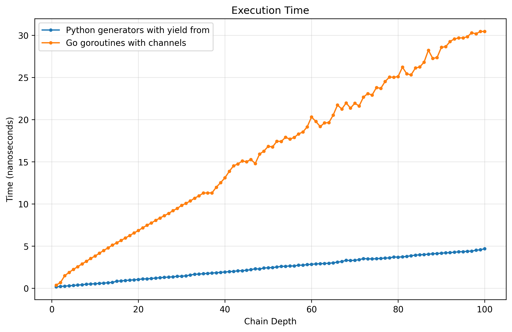
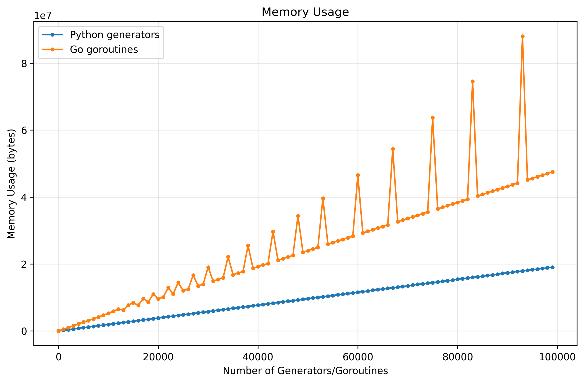
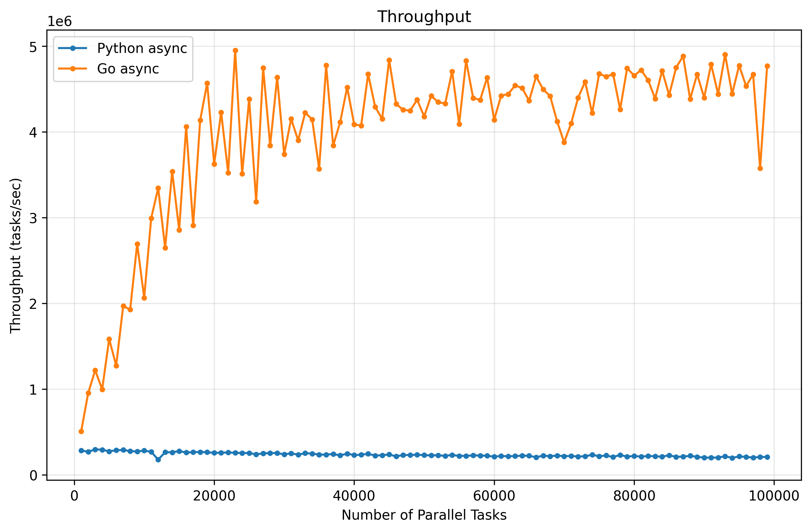
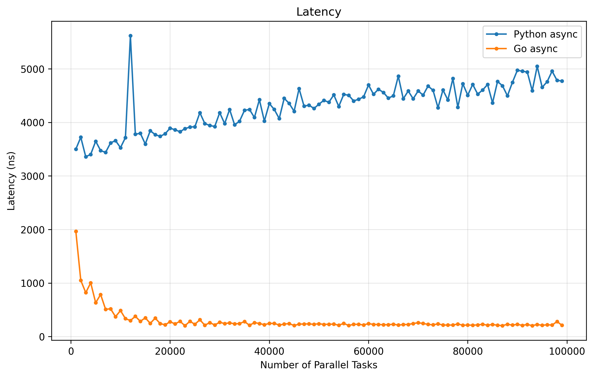

# Сравнение моделей конкурентности: Python vs Go

В этом лабораторном задании я сравниваю генераторы в Python и горутины в Go, чтобы понять, как они работают и какие преимущества и недостатки у каждой модели конкурентности.

## Python vs Go: философия

| Аспект | Python (генераторы) | Go (горутины) |
| --- | --- | --- |
| Парадигма | Мультипарадигменный язык | Конкурентно-ориентированный язык |
| Типизация | Динамическая | Статическая |
| Выполнение | Интерпретируемый | Компилируемый |
| Память | GC с GIL | GC без GIL |
| Конкурентность | Пользовательская (asyncio) | Встроенная в рантайм |

Go изначально проектировался как язык для конкурентного программирования, и его модель конкурентности является одной из его ключевых особенностей. Python же добавлял поддержку конкурентности постепенно, его модель конкурентности более сложная и менее эффективная из-за GIL, но она также более гибкая и может быть использована в широком спектре задач.

## Генераторы vs Горутины

Генераторы в Python работают в рамках одного потока, переключаются между собой с помощью `yield`, и не могут выполняться параллельно. Переключение генераторов происходит через переход внутри интерпретатора, и они не могут использовать несколько ядер процессора из-за GIL.

```python
def generator():
    while True:
        print(i)
        yield

gen = generator()
for _ in range(10):
    next(gen)
```

Горутины в Go являются легковесной версией потоков, которые управляются рантаймом Go. Они могут выполняться параллельно на нескольких ядрах процессора, и переключение между ними происходит через планировщик Go, который эффективно распределяет горутины по доступным ресурсам.

```go
func goroutine() {
    for i := 0; i < 10; i++ {
        fmt.Println(i)
    }
}

func main() {
    go goroutine()
    time.Sleep(time.Second)
}
```

## Стоимость переключения контекста

В Python переключение между генераторами происходит через переключение между фреймами в интерпретаторе и является легкой операцией. В Go переключение между горутинами происходит через канал и требует синхронизации, что может быть более дорогой операцией, особенно если горутины активно взаимодействуют друг с другом.

Вы можете ознакомиться с материалами бенчмарков в директории `research/benchmarks/context_switch/`.

```text
Среднее время итерации в Python: 34.44 наносекунд
Среднее время итерации в Go: 96.78 наносекунд
```

Мы видим, что переключение между генераторами в Python происходит значительно быстрее. Это связано с тем, что при переключении Python проверяет состояние генератора, переключается на его фрейм, а затем переключается обратно. В Go же сначала происходит блокировка мьютекса канала, затем основная горутина засыпает, горутина функции просыпается, выполняется, а затем блокирует мьютекс канала и просыпает основную горутину. Этот процесс требует больше операций и синхронизации, что увеличивает время переключения.

## Масштабируемость (глубина цепочки)

При переключении между вложенными генераторами Python использует `yield from`, который позволяет делегировать выполнение другому генератору внутри ВМ. Go же в свою очередь строит пайплайн горутин и каналов, что может привести к увеличению времени переключения при глубокой цепочке.

| Время выполнения (сравнение) |
| --- |
|  |

На графике видно, что в обоих случаях время выполнения линейно растет с увеличением глубины цепочки, однако в Go рост времени происходит значительно быстрее. Python не создает новые сущности для каждой итерации, а просто переключается между существующими фреймами, тогда как Go создает новые горутины и каналы для каждой итерации, что добавляет дополнительную стоимость. Вдобавок, прошлый эксперимент показал, что переключение между горутинами уже само по себе дороже.

## Потребление памяти

В этом эксперименте мы отслеживанием потребление памяти при увеличении количества объектов в генераторах и горутинах. 

| Потребление памяти (сравнение) |
| --- |
|  |

На графике видно, что в обоих случаях потребление памяти линейно растет с увеличением количества объектов, однако в Go рост потребления происходит значительно быстрее. 

В Python генератор — это объект внутри одного потока выполнения, он хранит минимальное состояние (фрейм), включающее указатель на текущую инструкцию, локальные переменные и стек значений внутри интерпретатора. После создания он не требует отдельного планировщика или дополнительных структур для переключения выполнения.

В Go горутина — это полноценная единица выполнения, управляемая рантаймом, которая имеет собственный стек (с динамическим расширением), структуру управления состоянием и идентификатор внутри планировщика, поэтому она требует выделения дополнительных runtime-структур для хранения и управления жизненным циклом.

## Throughput и Latency под нагрузкой

В Python asyncio выполняет задачи в одном потоке, переключаясь между ними с помощью `await`, что может привести к блокировке при выполнении CPU-bound задач. В Go же горутины могут выполняться параллельно на нескольких ядрах, что позволяет эффективно использовать ресурсы и поддерживать высокую производительность даже при высокой нагрузке.

| Throughput | Latency |
| --- | --- |
|  |  |

На графике Throughput видно, что с увеличением количества задач пропускная способность Python остается практически неизменной (меньше 1 задачи в секунду), тогда как пропускная способность Go значительно увеличивается, достигая более 4 задач в секунду при 18,000 параллельных задачах. Это связано с тем, что Python ограничен GIL и выполняет задачи кооперативно в одном потоке без реального параллелизма, тогда как Go использует многопоточную модель исполнения и может эффективно распределять задачи по нескольким ядрам процессора.

На графике Latency видно, что с увеличением количества задач задержка `async` постепенно увеличивается, достигая примерно 4500 нс к 80,000 параллельных задач, тогда как задержка `goroutine` начинается на уровне 2000 нс при 1 задаче, постепенно снижается и примерно к 15,000 задач стабилизируется на уровне 200 нс. Это связано с тем, что в Python при увеличении количества задач происходит больше переключений между задачами, что увеличивает общую задержку, тогда как в Go горутины могут выполняться параллельно, и планировщик эффективно распределяет задачи, поддерживая низкую задержку даже при высокой нагрузке.

## Заключение

В целом, генераторы в Python и горутины в Go представляют собой разные модели конкурентности, каждая из которых имеет свои преимущества и недостатки. Генераторы в Python являются легковесными и простыми в использовании, но они ограничены GIL и не могут использовать несколько ядер процессора. Горутины в Go являются мощными и эффективными для конкурентного программирования, но они требуют больше ресурсов и могут быть сложнее в управлении. Выбор между ними зависит от конкретных требований проекта и предпочтений разработчика.
